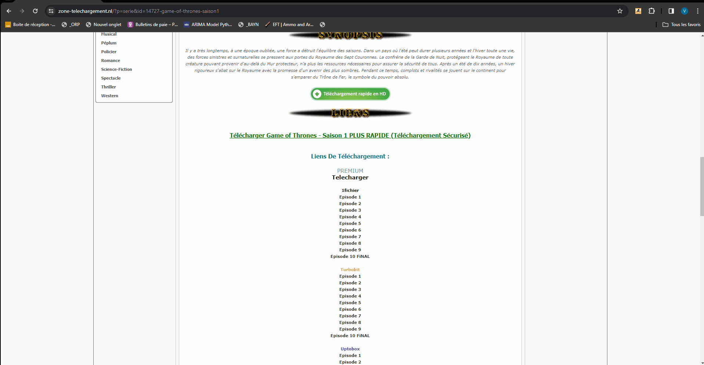

# Alldebrid Portable

Alldebrid Portable is a Chrome extension designed to make your downloading experience more efficient from various file hosting services. By enabling you to debrid links with a simple right-click and "Debrid Link" option, it facilitates streaming your desired content directly in VLC without downloading the files. This tool is invaluable for users who frequently download from file hosters and seek a streamlined, hassle-free streaming experience.

## Features

- **Right-Click to Debrid**: Simplify your download process with a right-click on any supported file hoster link.
- **Manual Stream in VLC**: After debriding, manually stream your content in VLC for a seamless viewing experience.
- **Open Source**: Embracing the spirit of collaboration, Alldebrid Portable is an open-source project. We encourage improvements, forks, and copies. Your contributions are welcome!

## Requirements

- **Alldebrid API Key** : An Alldebrid API key is required for the extension to interact with Alldebrid services and convert your download links.
- **Google Chrome** : This extension works only with Google Chrome. 

## Installation

1. Download the extension from [GitHub](https://github.com/ValentinGuicheteau/AlldebridPortable) and unzip it.
2. In Chrome, navigate to `chrome://extensions/` and toggle on **Developer mode**.
3. Choose **Load unpacked** and select the extension's folder.
4. Once your extension is installed you can click on the extension icon in chrome. The pop up will appears, you can click settings button and insert your valid Alldebrid API KEY.

Alldebrid portable is now ready o use.

## Usage

To use Alldebrid Portable, follow these simple steps:

1. Right-click on a link from a supported file hoster and select "Debrid Link". The extension processes and debrids the link.
2. A popup will appear with the debrided link. Copy this link.
3. Open VLC, press **Ctrl+N** to open the network stream option, paste the debrided link into the text box, and press play. Your content will now stream directly in VLC.

### Step-by-Step Guide

For a visual guide on how to stream your files in VLC using Alldebrid Portable, see the gif below:

## Support & Contributions

For questions or support, feel free to contact me. Contributions to the project, whether they're bug fixes, new features, or documentation improvements, are highly encouraged.

## License

Alldebrid Portable is released under the MIT License and is open for any use, modification, and distribution. Your participation can help this project grow and improve.

For any inquiries or contributions, please contact me. I look forward to your feedback and contributions!
